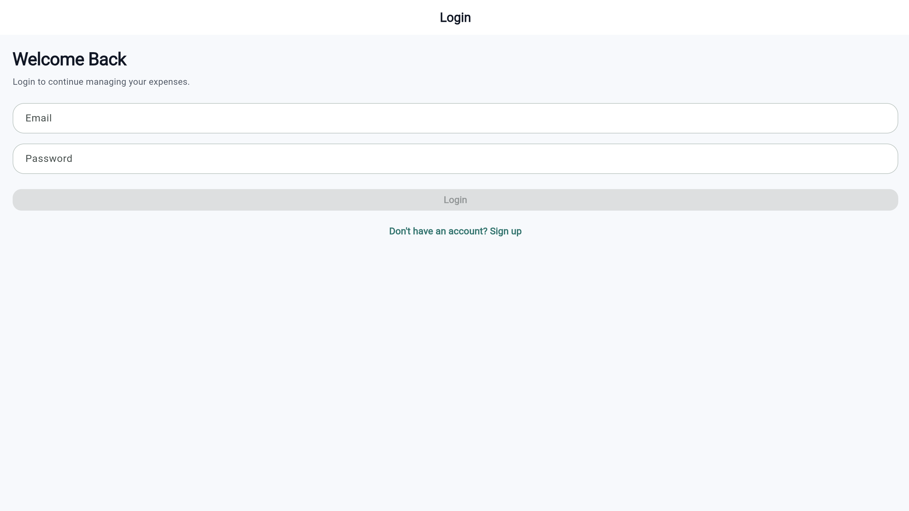
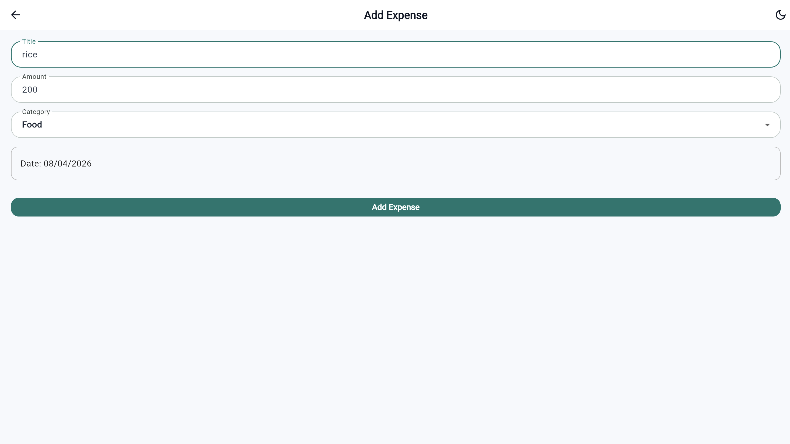
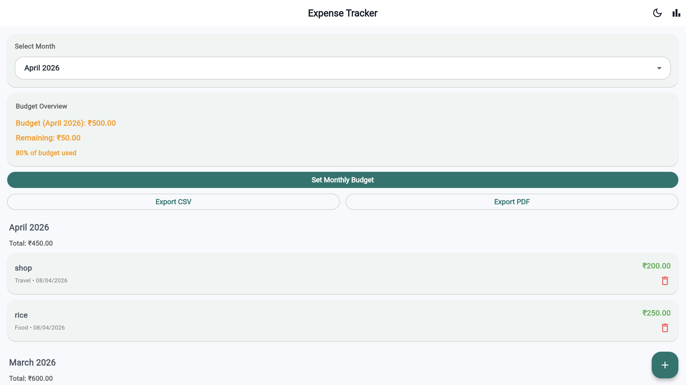
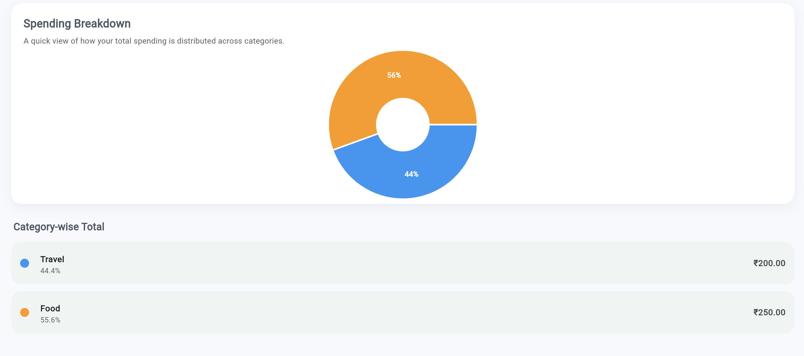
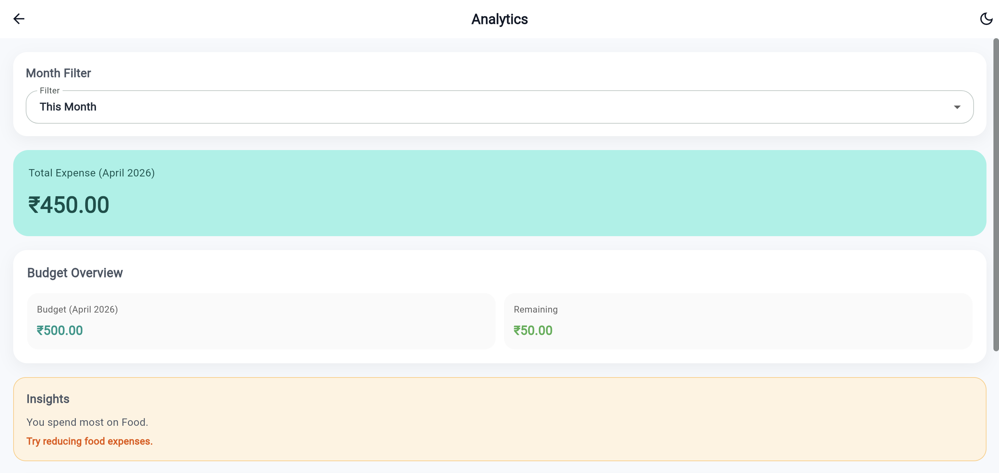

# 💰 Expense Tracker (Flutter + Firebase)

A full-stack mobile application to track daily expenses, manage budgets, and analyze spending patterns in real time.

---

## 🚀 Features

- 🔐 User Authentication (Firebase Auth)
- 📊 Add, edit, and delete expenses
- 🗂️ Category-based expense tracking
- ⚡ Real-time data sync using Firestore
- 📈 Spending insights and analytics
- 📄 Export reports (PDF/CSV)
- 🔔 Budget alerts and notifications

---

## 🛠️ Tech Stack

- **Frontend:** Flutter (Dart)
- **Backend:** Firebase
- **Database:** Cloud Firestore
- **Authentication:** Firebase Auth

---

## 📱 Screenshots

- 
- 
- 
- 
- 

---

## ⚙️ Installation

```bash
git clone https://github.com/your-username/expense-tracker-flutter.git
cd expense-tracker-flutter
flutter pub get
flutter run
